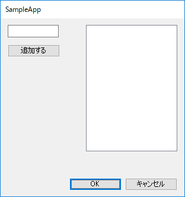
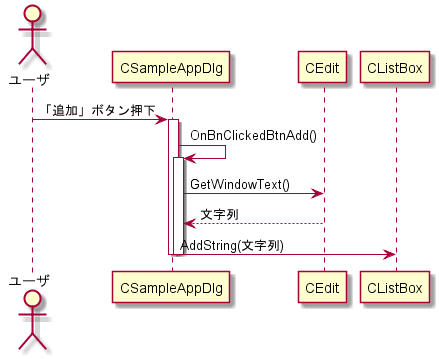
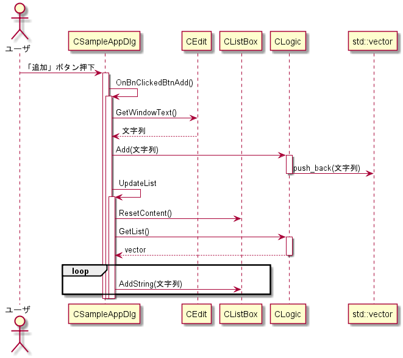

# MFCダイアログのテストカバレッジを高くしたい

## (解決策1) ダイアログクラスからロジックを分離する

ダイアログクラスのイベントハンドラに、ロジックを直接記述しない。
ロジックは別クラスに記述し、イベントハンドラからそのメソッドを呼び出すようにする。
こうすればロジック側はMFCのUIコントロールから切り離されるのでテストが容易になる。

この手法はHumble ObjectやHumble Dialogと呼ばれる。

### 例

(ロジックが単純なため却って複雑になっており、良いサンプルではない…)

#### before

#### after

## (解決策2) UIコントロールをモック化

1つのイベント中で複数のUIコントロールを協調させている場合、その部分にも複雑なロジックが発生するかもしれない。
そこまで含めたユニットテストを書きたい場合、UIコントロールのモックを作り、それらに対する呼び出しをテストすることもできる。
(→ [UiLogicTest.cpp](https://github.com/asura/MakeMfcDialogTestable/blob/master/logicTest/UiLogicTest.cpp))

が、課題もある…

### 課題

下記はGoogleMockを使う前提。

- MFCのUIコントロールクラス群のメソッドは非virtual。
- この場合、モックを作るために2つの選択肢がある。
  - (1) UIコントロールクラスと無関係に、同じメソッド群をもつモッククラスを定義する。本物のクラスを使うかモッククラスを使うかは、template引数で指定する。 → [非仮想メソッドをモック化する](http://opencv.jp/googlemockdocs/cookbook.html#cookbook-mocking-nonvirtual-methods)
   - (2) インタフェースを定義する。実コードでは、インタフェースから派生し、UIコントロールクラスのメソッドを呼び出すラッパークラスを使う。テストでは、インタフェースから派生したモッククラスを使う。 → [具象クラスのモック化に対する代替案](http://opencv.jp/googlemockdocs/cookbook.html#cookbook-alternative-to-mocking-concrete-classes)
- (1)の場合、クラスをtemplateで指定するため、クラスメソッドに対するIntelliSenseが効かない。ISによる補完やコメント表示に頼りきっている場合、ビルドしてみないと正しいかわからないため不安。
- (2)の場合、インタフェース・ラッパークラス・モッククラスと、余分なクラスを定義するのが面倒。
  - モッククラスは[gmock_gen.py](https://github.com/google/googletest/blob/master/googlemock/scripts/generator/gmock_gen.py)を使えば生成できるはず。

## (解決策3) UIをテストする

(策2)にコストを費してロジックテストを頑張るよりは、いっそUI経由のテストを実行した方が楽かもしれない。

- [Friendly](http://www.codeer.co.jp/AutoTest)
- [TestStack/White: TestStack.White](https://github.com/TestStack/White)
- [UI オートメーションを使用してコードをテストする](https://msdn.microsoft.com/ja-jp/library/dd286726.aspx?f=255&MSPPError=-2147217396)